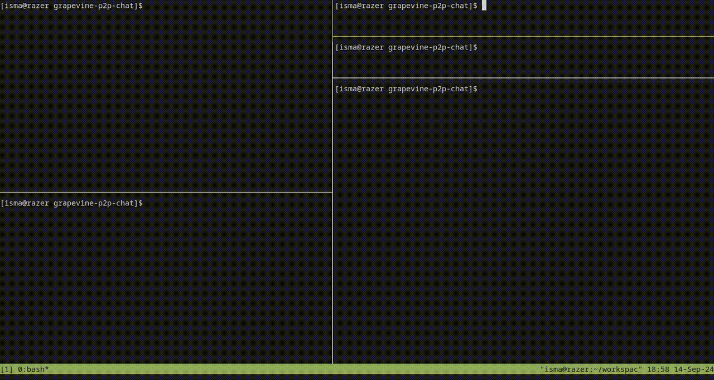
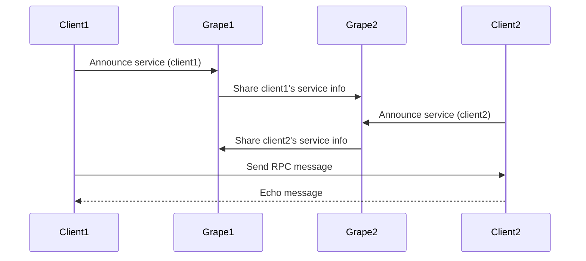

## # Grapevine 🍇🌿 P2P Chat

Grapevine is a **peer-to-peer (P2P) chat system** built using the **Grape Distributed Hash Table (DHT)**. It enables decentralized communication between clients, allowing them to find and send messages to each other without a central server. Grape nodes manage service discovery, while clients communicate using **Remote Procedure Calls (RPCs)**.

<div style="text-align: center;">
    
</div>

### 🛠️ Setup and Run

#### 1. **Run Grape Nodes**

Grape nodes form the backbone of the DHT network, allowing peers to register and discover each other.

- **Run grape1:**

  ```bash
  grape --dp 20001 --aph 30001 --bn '127.0.0.1:20002'
  ```

- **Run grape2:**
  ```bash
  grape --dp 20002 --aph 40001 --bn '127.0.0.1:20001'
  ```

These Grape nodes are connected to each other, creating a **DHT network** where services (like client1 and client2) can be announced and discovered.

#### 2. **Run Server Clients**

Start the server processes for `client1` and `client2`, which will register themselves to the Grape DHT and wait for messages.

- **Run client1 (on port 1337):**

  ```bash
  node src/server.js client1 1337
  ```

- **Run client2 (on port 1338):**
  ```bash
  node src/server.js client2 1338
  ```

The server clients (`client1` and `client2`) will announce themselves to the DHT, making them available for discovery by other peers.

#### 3. **Run the Client to Send Messages**

The client script allows you to send messages to any registered peer by looking them up in the DHT.

- **Run the client interaction:**
  ```bash
  node src/client.js
  ```

You'll be prompted to choose a peer (e.g., `client1` or `client2`) and then send a message. The client will keep running until you choose to exit.

---

### 🔄 Application Flow

1. **Grape Nodes** (`grape1` and `grape2`) form the **DHT network**, where peers register themselves.
2. **Server clients** (`client1` and `client2`) announce their availability on the DHT by periodically sending messages to the Grape nodes.
3. **Client script** (when run) allows you to look up available peers by querying the DHT. Once found, it sends an RPC message to the chosen peer, and the peer responds with an acknowledgment.

---

### 🧑‍💻 What Each File Does

- **src/server.js**:

  - Starts a peer server (like `client1` or `client2`) on a specific port.
  - Registers itself to the DHT and listens for messages from other peers.
  - Sends a response to any incoming message (e.g., `Echo: <message>`).
  - Continuously announces its presence to the Grape DHT.

- **src/client.js**:
  - Allows the user to send messages to a peer by looking them up in the DHT.
  - Prompts the user for the peer name, sends the message, and displays the response from the peer.
  - Continues running until the user decides to exit.

---

### 📊 P2P Networking Flow with Mermaid Chart



### 🗂️ File Structure

```
/assets
/src
  ├── server.js                     # Server-side code for peer clients (client1, client2)
  └── client.js                     # Client interaction script to send messages
/tests
  └── grape.integration.test.js
```

---

### 🌿 How the P2P System Works

- **DHT Setup**: Grape nodes (`grape1`, `grape2`) form a decentralized hash table (DHT). Services (like `client1` and `client2`) register with the Grape DHT, making themselves discoverable.
- **Peer Discovery**: When the client script is run, it looks up a peer in the DHT (e.g., `client1` or `client2`), fetching the address of the peer.
- **Message Exchange**: The client sends an RPC request to the chosen peer, and the peer responds to the message.

---

### 📚 Useful Resources:

- [Microservices with Grenache]([Microservices with Grenache](https://blog.bitfinex.com/tutorial/bitfinex-loves-microservices-grenache/))
- [Grenache GitHub repository](https://github.com/bitfinexcom/grenache)
- [Mastering P2P: The Power of Decentralized Networking!](https://isma.codes/blog/mastering_p2_p_the_power_of_decentralized_networking)
