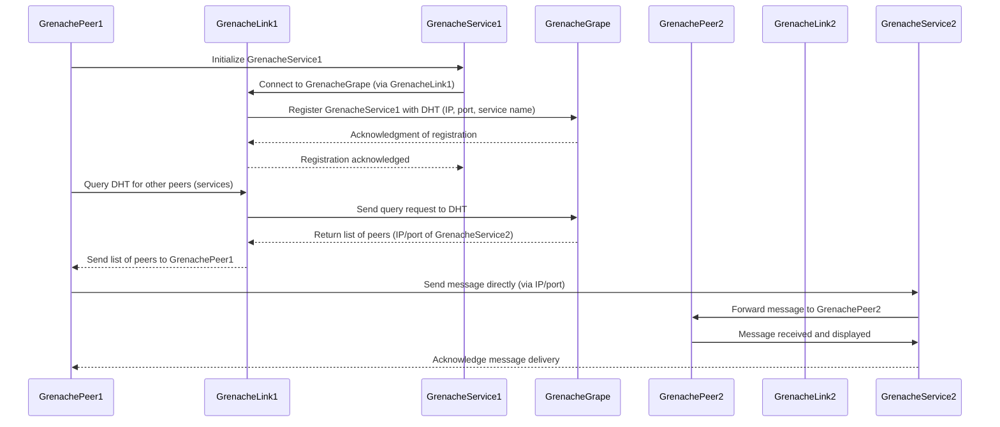

# Concept Overview

The **P2P Chat Application** allows users (peers) to send and receive messages without relying on a central server. Instead, peers register themselves in a distributed network using **GrenacheGrape**, which acts as the system’s "phonebook" (Distributed Hash Table, or DHT). Once registered, peers can discover each other and exchange messages in real time via **WebSocket (WS)**.

## Key Components:

- **GrenachePeer**: The user (client) participating in the chat. Each peer can send and receive messages.
- **GrenacheService**: The service that handles the actual messaging functionality for each peer.
- **GrenacheGrape**: The distributed DHT system used for service discovery. It stores the location (IP and port) of peers (GrenacheServices) so they can find each other.
- **GrenacheLink**: Connects the peers and services to the DHT via GrenacheGrape, facilitating service registration and discovery.

---

## Flow of the P2P Chat Application

- **Peer Initialization and Registration**: **GrenachePeer1** initializes **GrenacheService1**, which registers its details (IP, port, service name) with the **GrenacheGrape** (DHT) through **GrenacheLink1**, making it discoverable by other peers. **GrenacheGrape** stores this information in the DHT and acknowledges the registration.

- **Discovering Other Peers (Service Discovery)**: **GrenachePeer1** queries the DHT via **GrenacheLink1** to find other registered services (peers). **GrenacheGrape** returns the list of available services, such as **GrenacheService2**, including their IP and port details.

- **Message Sending (Peer-to-Peer Communication)**: After discovering **GrenacheService2**, **GrenachePeer1** sends messages directly to **GrenacheService2** using its IP/port via **WebSocket (WS)**. **GrenacheService2** forwards the message to **GrenachePeer2** for display.

- **Receiving Messages**: **GrenachePeer2** receives and displays the message, while **GrenacheService2** acknowledges receipt to **GrenachePeer1** to confirm successful message delivery.

## Detailed Example of the Flow

Let’s say there are two users, **Alice** and **Bob**, who want to chat using this P2P system.

1.  **Alice’s GrenachePeer starts and registers**:

    - Alice’s **GrenachePeer** starts a local **GrenacheService** to handle messages.
    - This service registers with the **GrenacheGrape** DHT, telling the network: “I’m Alice, and I’m available at IP X and port Y.”

2.  **Bob’s GrenachePeer does the same**:

    - Bob’s **GrenachePeer** starts a **GrenacheService**, which registers itself with the **GrenacheGrape** DHT, providing its IP and port.

3.  **Service Discovery**:

    - Alice’s **GrenachePeer** queries the **GrenacheGrape** DHT to find active peers. The DHT responds with Bob’s IP and port, allowing Alice to discover Bob’s **GrenacheService**.
    - Similarly, Bob can discover Alice’s service in the same way.

4.  **Sending Messages**:

    - Now that Alice’s **GrenachePeer** knows where Bob’s **GrenacheService** is, Alice can send a message directly to Bob using **WebSocket (WS)**.
    - Alice’s **GrenachePeer** sends a message to Bob’s **GrenacheService**, which receives the message and forwards it to Bob’s **GrenachePeer**.

5.  **Receiving Messages**:

    - Bob’s **GrenachePeer** receives the message from Bob’s **GrenacheService** and displays it in Bob’s chat window.
    - Bob can reply by sending a message through his **GrenachePeer**, which is routed through the DHT to find Alice’s **GrenacheService**, and the cycle repeats.

## Potential Features:

1.  **Peer Registration and Deregistration**: When a peer joins or leaves the chat, the **GrenacheService** is registered or deregistered in the DHT.
2.  **Broadcast Messages**: Instead of one-to-one messages, a **GrenachePeer** could broadcast a message to multiple peers (discovered via **GrenacheGrape**).
3.  **Chat Rooms**: Peers can register different services for different chat rooms (e.g., "Room A" and "Room B") and only send/receive messages from that room.

## Advantages of Using Grenache:

- **Decentralization**: No central server is needed, so there’s no single point of failure.
- **Scalability**: More peers can join the network dynamically, and the system will scale automatically using the DHT.
- **Fault Tolerance**: If a Grape node goes down, other Grape nodes in the network can still handle service discovery, ensuring chat continuity.

## Summary of Key Steps:

1.  **Start**: GrenachePeer starts and registers its GrenacheService with GrenacheGrape.
2.  **Discover**: GrenachePeer queries GrenacheGrape for other GrenacheServices (peers).
3.  **Communicate**: GrenachePeer sends messages directly to discovered GrenacheServices (peers) via WebSocket (WS).
4.  **Receive**: GrenacheServices listen for and forward messages to their respective peers.
